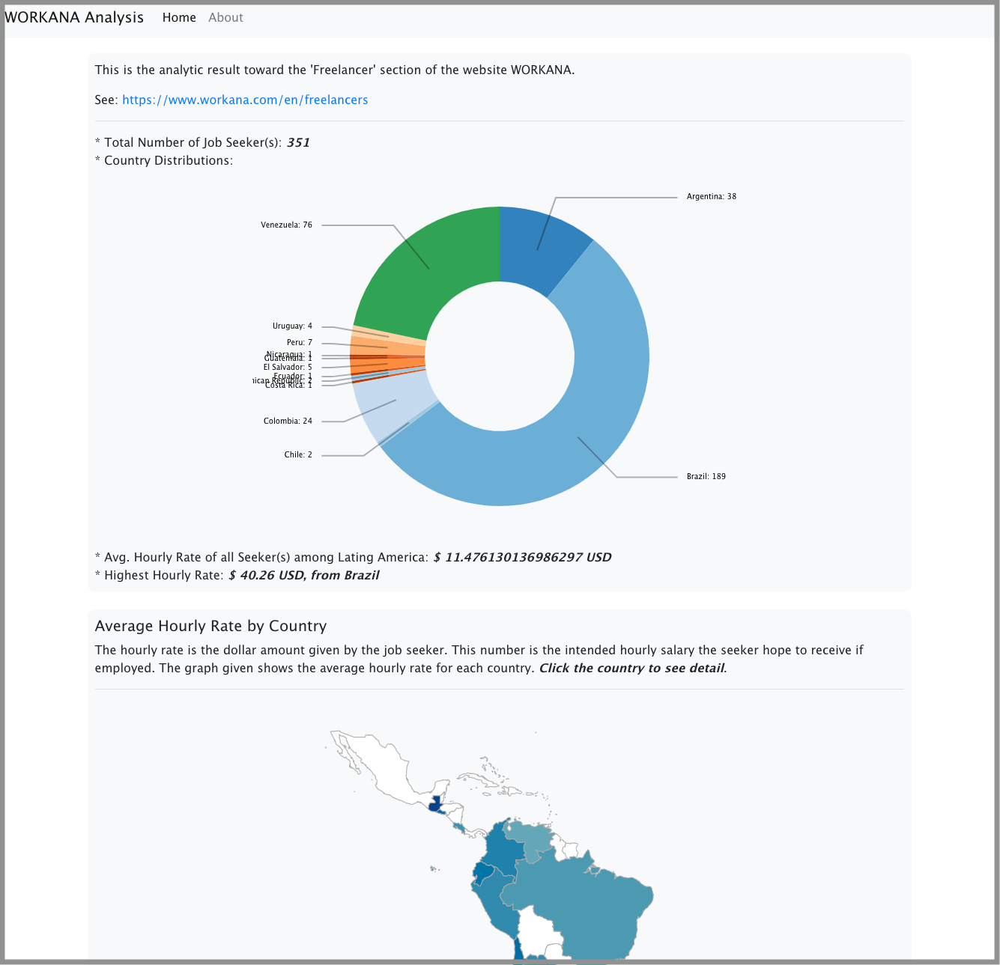
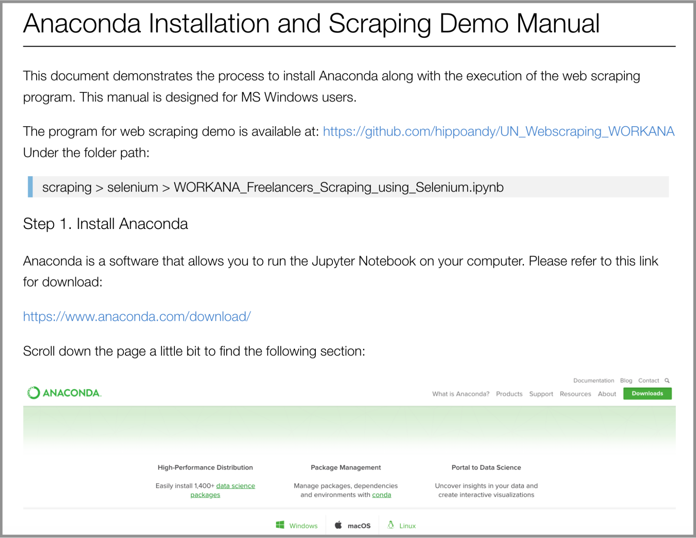

# UN Web Scraping Final Report
## Andy Ho, Student ID: 915528994

In this quarter, I learned to use **Jupyter** Notebook for fast and interactive data visualizations based on the dataset created by the web scraping team. I demonstrated the data analysis result using **D3.js** with a web-based application implemented by **Python-Flask**, a light-weight Python backend server, and pure *JavaScript* with **HTML5** and **LESS**.

The screenshot of the web-based visualization is as follows:

The ReadMe file for the web-based visualization is available at:
[https://github.com/hippoandy/UN_Webscraping_WORKANA/blob/master/web/README.pdf](https://github.com/hippoandy/UN_Webscraping_WORKANA/blob/master/web/README.pdf)

I also learned to perform web scraping using **BeautifulSoup4** and **Selenium** library. Both of the scraping application is available in pure Python program version or a Jupyter version. I created a user manual for user to understand how to install the required program environment and how to execute my program using Selenium.

The screenshot of the manual is as follows:

All of my program and achievements are available on my Github page, the repo homepage is: [https://github.com/hippoandy/UN_Webscraping_WORKANA](https://github.com/hippoandy/UN_Webscraping_WORKANA).

The link of the individual program are listed as follows:
* Web Application: [https://github.com/hippoandy/UN_Webscraping_WORKANA/tree/master/web](https://github.com/hippoandy/UN_Webscraping_WORKANA/tree/master/web)
* Pure Python and Jupyter scraper using **Selenium**: [https://github.com/hippoandy/UN_Webscraping_WORKANA/tree/master/scraping/selenium](https://github.com/hippoandy/UN_Webscraping_WORKANA/tree/master/scraping/selenium)
* Pure Python and Jupyter scraper using **BeautifulSoup4**: [https://github.com/hippoandy/UN_Webscraping_WORKANA/tree/master/scraping/bs4](https://github.com/hippoandy/UN_Webscraping_WORKANA/tree/master/scraping/bs4)

## Collaborations

1. **Karen Su**: During this quarter, I had several discussion with **Karen Su** about what kind of data visualization we could present among the existing dataset. We only have oral discussion, not really working on code together. Therefore, it is hard for me to judge her ability and performance among coding. However, she is open to different ideas and willing to learn something new.
2. **William Hsiao**: After I got back from Taiwan due to my medical concern, **William** is the person who helped me catch up the current progress of the whole group. He also demonstrated the idea for web scraping throught his code. After the discussion with him to combine our scraping code, I realized he is a strong implementer and very familiar with Python.