# Instruction Manual

### Step 1. Install Anaconda

Anaconda is a software that allows you to run the Jupyter Notebook on your computer.
Please refer to this link for download:

[https://www.anaconda.com/download/](https://www.anaconda.com/download/)

Scroll down the page a little bit to find the following section:
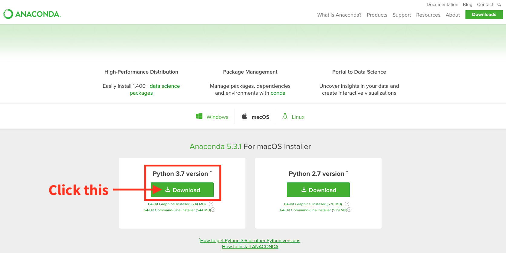

Please download the ***Python 3.7 version*** of Anaconda

Then please install Anaconda using the downloaded executable.

#### Windows User
Please execute the installer and keep click on '***Next***' without changing any settings until you see this page:
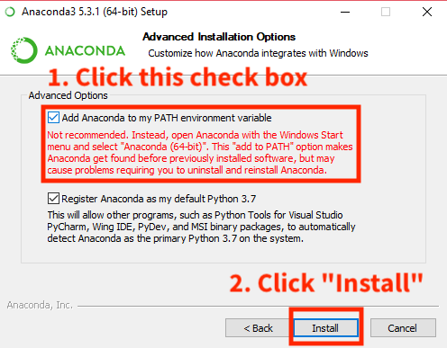

Make sure you check the option "**Add Anaconda to my PATH environment variable**" before you click "***Install***".

If the installer is asking you to install "MS Visual Studio Code", please ignore it.

### Step 2. Install Required Python Libraries

We are now installing the required Python libraries to allow the program to execute correctly.

#### Windows User
1\. Please open **CMD** program with "Administrator Privilege"

On the Windows taskbar, find a circle icon and click it

You will see a input field at the button, type "**cmd**"
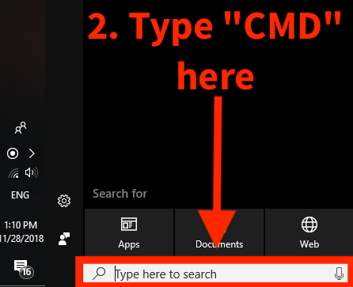

The cmd program will show up in the window.

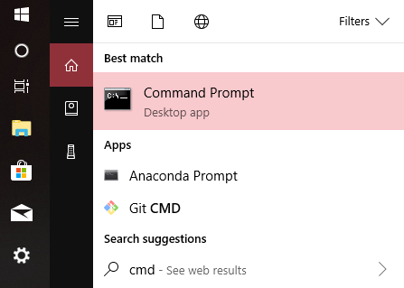

Please right click on it and choose "Run as administrator"

Here is the CMD window:

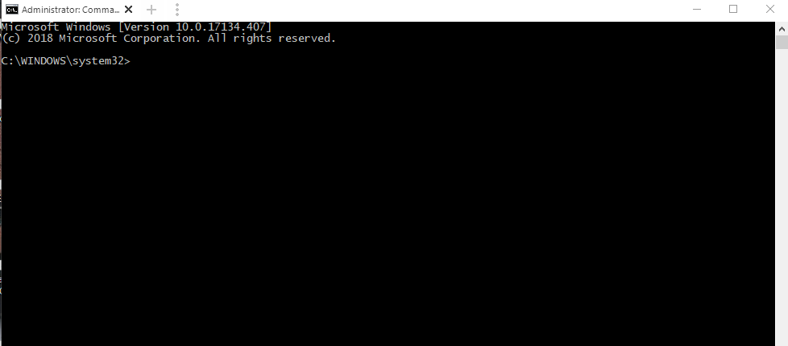

2\. Insert the command to install the libraries:

This is the command for installation:

> conda install -c conda-forge selenium pandas numpy

Copy & paste this line to the CMD window and press "Enter" key.

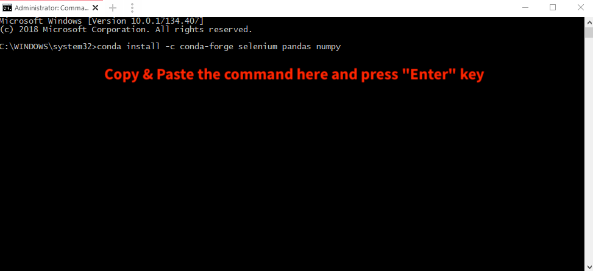

Then, you will see a message like the following, type '**y**' and press "Enter" key.

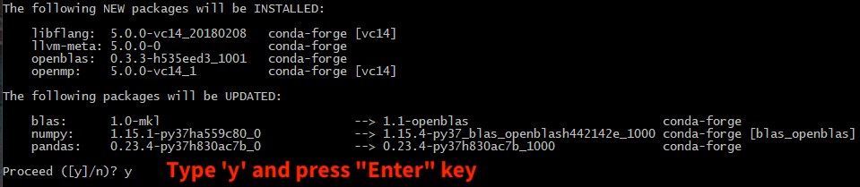

Wait until the progress complete.

### Step 3. Download additional Lib. file and the Program

#### 1\. Download Chrome Driver

Please refer to this link:
[https://chromedriver.storage.googleapis.com/index.html?path=2.42/](https://chromedriver.storage.googleapis.com/index.html?path=2.42/)

Download Windows version Chrome Driver as:
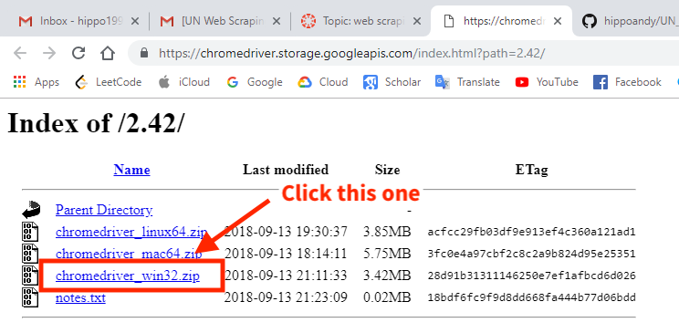

Open the downloaded **.zip** file and extract the "**chromedriver.exe**" to your **Downloads** folder

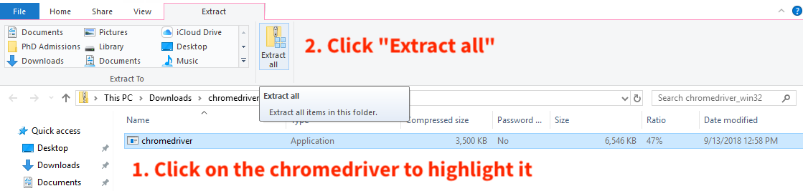

You will see a window shows up, change the pathe to your **Download** folder and click "**Extract**"

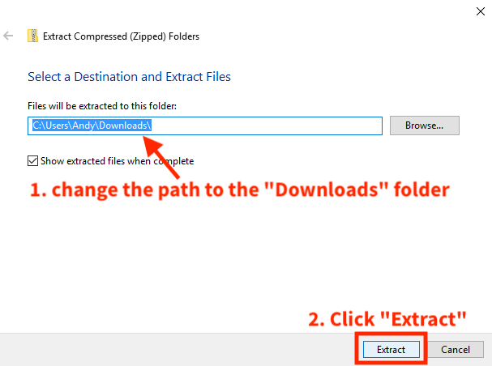

#### 2\. Download the program files:

Please refer to this link:
[https://github.com/hippoandy/UN_Webscraping_WORKANA/](https://github.com/hippoandy/UN_Webscraping_WORKANA/)

Download the program .zip file as:
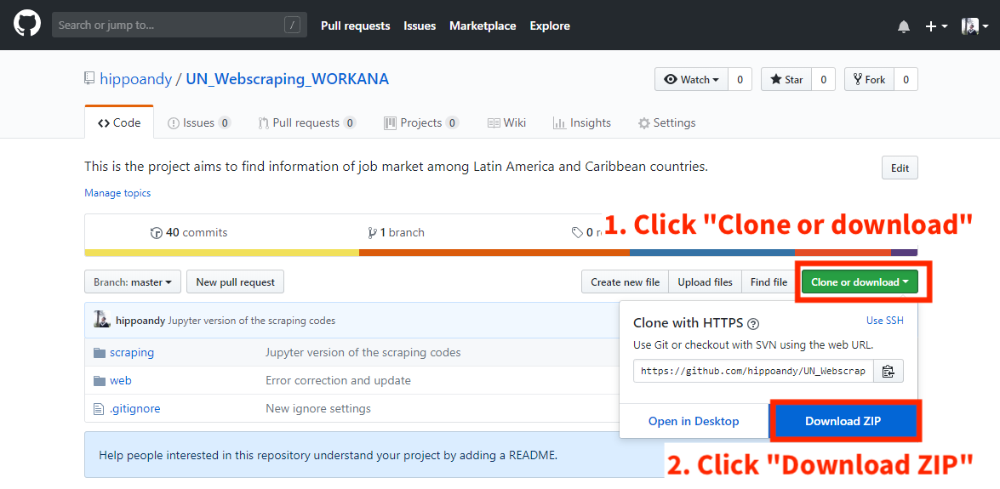

Open the downloaded .zip file and extract the content:
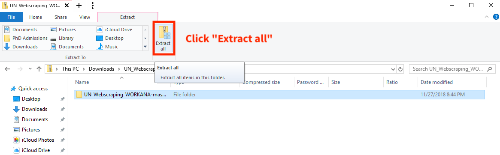

Make sure to change to destination path to your **Download** folder:
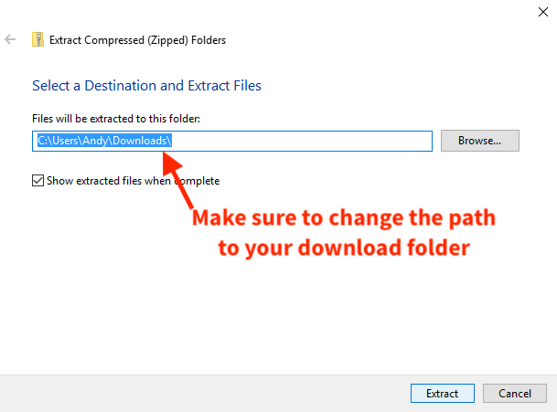

### Step 4. Open Jupyter Notebook Application

#### 1\. Open Anaconda then Jupyter

Open you installed Anaconda Program, you should see a window like this:
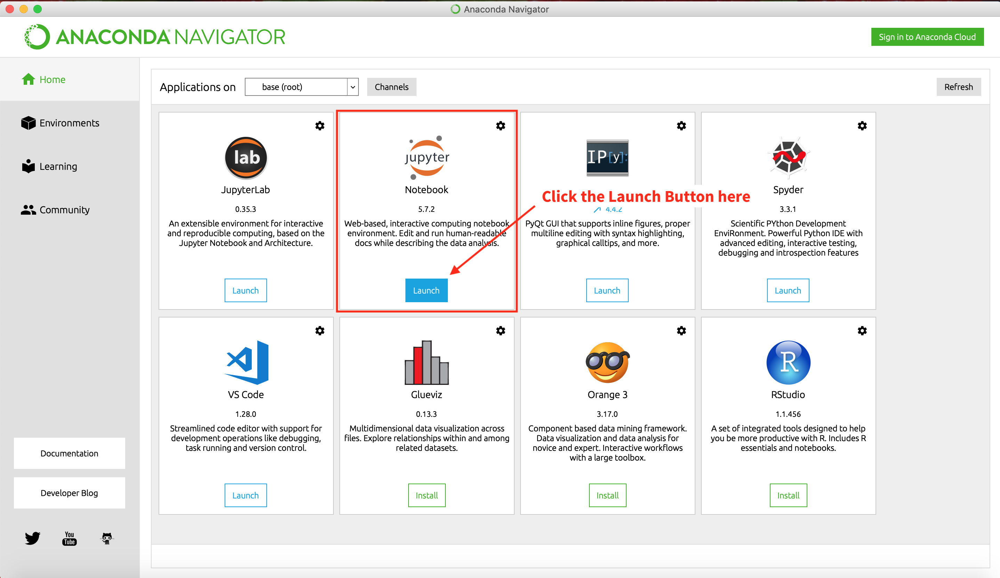

To launch the Jupyter Notebook, click the "**Launch**" button of it.

Then, you should see you browser opens up and shows a page like this:
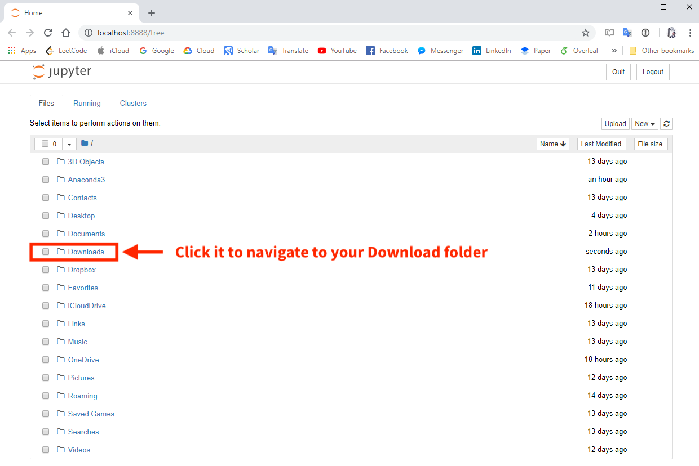

Navigate to your Download folder, and you should see this:
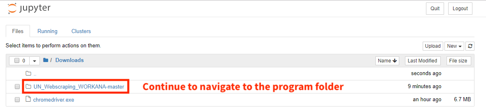

Here you will see the downloaded files instructed in the previous section.
Continue to naviagate to the program folder:

> UN\_Webscrpaing\_WORKANA-master > scrpaing > selenium

Then, you should see this page:
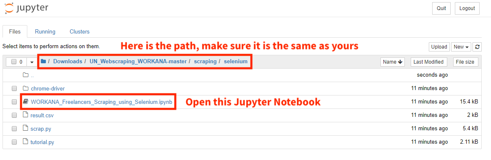

Click on the Jupyter Notebook to open the program.

Here is the Jupyter Notebook program
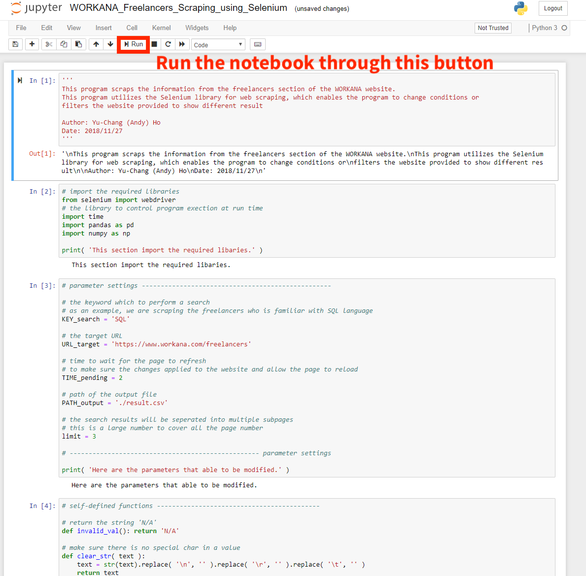

Please use the run button to execute the notebook.

#### 2\. Run the Notebook

Before execution, please find the driver section of the code, the section starts with the line:
> \#\#\# load the chrome driver executable

Replace the **<user>** tag to your computer user name:
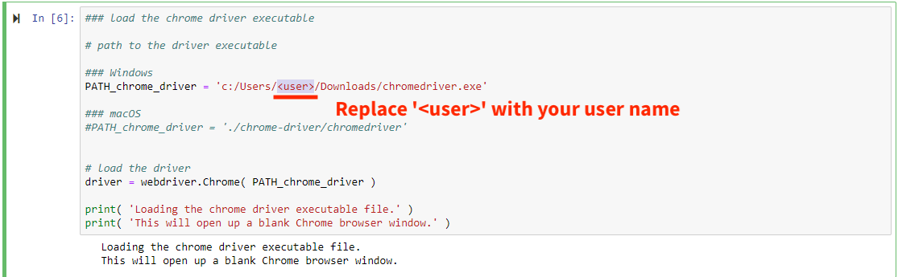

To find your user name, you may check the properties information of the **chromedriver.exe** file.

Headed to your Downloads folder, right click on the **chromedriver.exe** and choose "**Properties**".
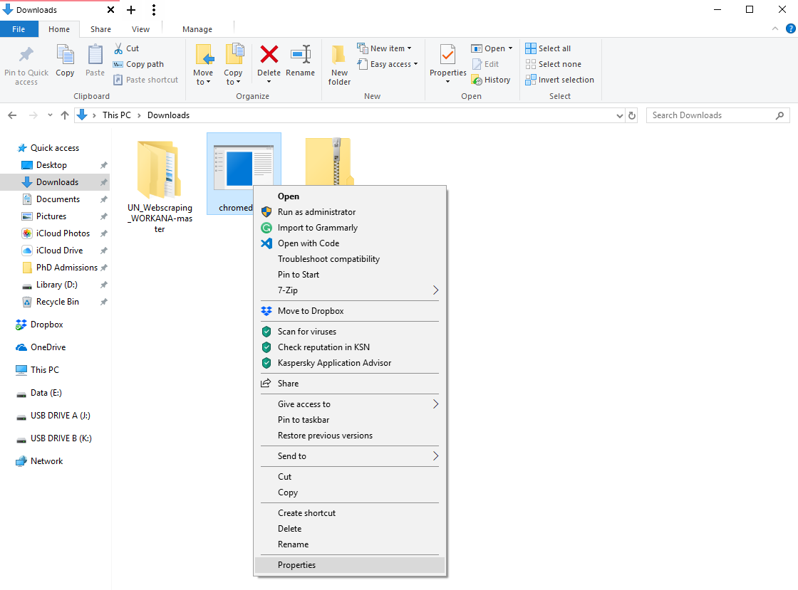

You will see a window like this, the location field indicated the user name:
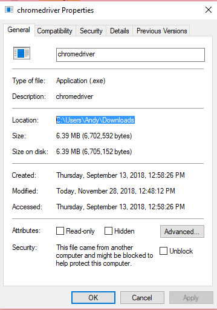

Here, the user name is "**Andy**".

Please go back to the Jupyter notebook and replace the user name with yours.

If you see this window while running the program, please click "**Allow**".
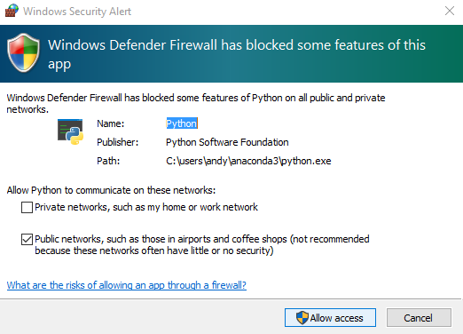

