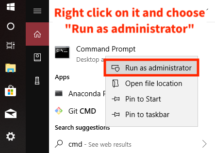

# Instruction Manual

### Step 1. Install Anaconda

Anaconda is a software that allows you to run the Jupyter Notebook on your computer.
Please refer to this link for download:

[https://www.anaconda.com/download/](https://www.anaconda.com/download/)

Scroll down the page a little bit to find the following section:

Please download the ***Python 3.7 version*** of Anaconda

Then please install Anaconda using the downloaded executable.

#### Windows User
Please execute the installer and keep click on '***Next***' without changing any settings until you see this page:

Make sure you check the option "**Add Anaconda to my PATH environment variable**" before you click "***Install***".

If the installer is asking you to install "MS Visual Studio Code", please ignore it.

### Step 2. Install Required Python Libraries

We are now installing the required Python libraries to allow the program to execute correctly.

#### Windows User
1\. Please open **CMD** program with "Administrator Privilege"

On the Windows taskbar, find a circle icon and click it

You will see an input field at the button, type "**cmd**"

The cmd program will show up in the window.

Please right click on it and choose "Run as administrator"

Here is the CMD window:

2\. Insert the command to install the libraries:

This is the command for installation:

> conda install -c conda-forge selenium pandas numpy

Copy & paste this line to the CMD window and press "Enter" key.

Please wait for a couple of minutes. Then, you will see a message like the following, type '**y**' and press "Enter" key.

Wait until the progress complete.

### Step 3. Download the Program Files

#### Download the program files:

Please refer to this link:
[https://github.com/hippoandy/UN_Webscraping_WORKANA/](https://github.com/hippoandy/UN_Webscraping_WORKANA/)

Download the program .zip file as:

Open the downloaded .zip file and extract the content:

Make sure to change to destination path to your **Download** folder:

### Step 4. Open Jupyter Notebook Application

#### 1\. Open Anaconda then Jupyter

Open you installed Anaconda Program, you should see a window like this:

To launch the Jupyter Notebook, click the "**Launch**" button of it.

Then, you should see your browser opens up and shows a page like this:

Navigate to your Download folder, and you should see this:

Here you will see the downloaded files instructed in the previous section.
Continue to navigate to the program folder:

> UN\_Webscrpaing\_WORKANA-master > scraping > selenium

Then, you should see this page:

Click on the Jupyter Notebook to open the program.

Here is the Jupyter Notebook program

Please use the run button to execute the notebook.

#### 2\. Run the Notebook

If you see this window while running the program, please click "**Allow**".

