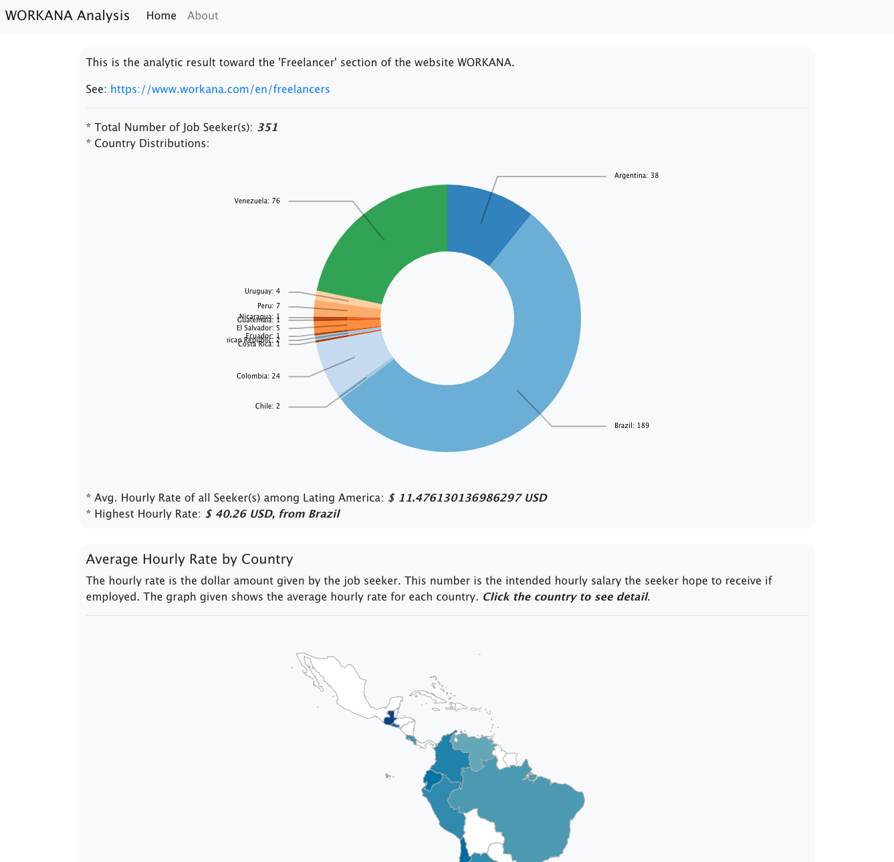

# Web-based Visualization for UN Web Scraping Project

This application is a web-based visualization for the data visualizatio among the WORKANA dataset created by web scraping team.

Web pages are written in **JavaScript**, **HTML**, and **LESS**.
The application is embedded in a backend server application written in **Python-Flask**


## Run the application

1\. Make sure your version of Python is in 3.7 or above.


2\. Install required Python libraries:
### Windows User:
Make sure **Python is in your environment variables**, then use the **Command Prompt (CMD)** application with **Administrator Permission** to run the following command (without the '$' sign):
```bash
$ pip3 install flask pandas numpy seaborn scipy matplotlib
```

### macOS User:
Make sure **Python 3.7 or above is installed**, then use the **Terminal** application to run the following command (without the '$' sign):
```bash
$ pip3 install flask pandas numpy seaborn scipy matplotlib
```

3\. Start-up the application:
Run the following command to execute the web application:
```bash
$ python3 ./server.py
```

4\. Open up a browser to see the result:
Open a browser and input the following URL to it for showing the result:
> http:127.0.0.1:8080

## Screenshot


